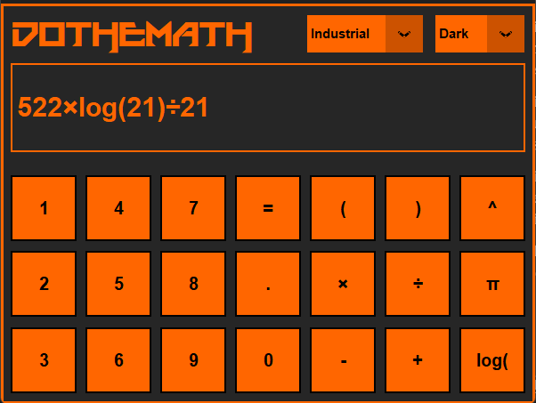
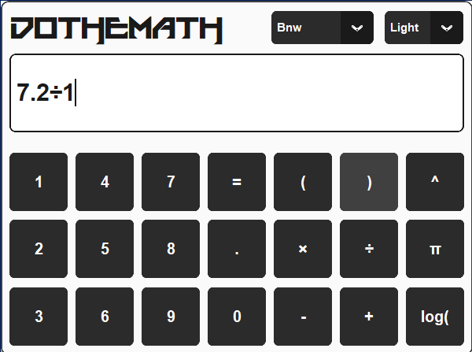
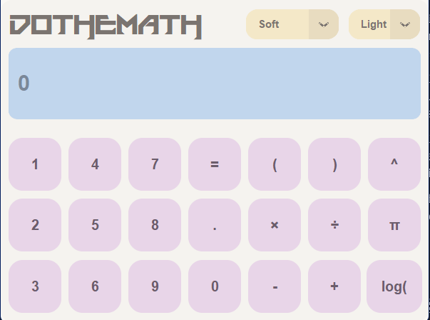

# DoTheMath

### A fully functional, stylized calculator as an application on your desktop.

## Dates:
Creation date: 2/14/2026  
Completion date: 2/18/2026

## Features: 

- Supports most common calculator functions.
- User can choose between light mode and dark mode at any time.
- Includes 14 custom-made themes in distinct styles, such as .

# Screenshots:

   

   

   

 

## How to run: 

1. Download the `DoTheMath.exe` file in Releases.
2. Double-click to run. No setup or extra files required!

*Note: If Windows Defender flags the .exe as suspicious, it is a false positive common with PyInstaller.*

## For developers:

If you want to run the Python script directly:

1. Ensure you have Python 3.x installed.
2. This project uses customtkinter and sympy - install with `pip install customtkinter` and `pip install sympy` 
3. Download the repository.
4. Ensure the `icon` folder, `themes` folder, `do_the_math_gui.py`, and `do_the_math_logic.py` are in the same directory.
5. Execute the main GUI script: `do_the_math_gui.py`

### Project Structure:

- `do_the_math_gui.py`    &nbsp;&nbsp;&nbsp;&nbsp;&nbsp;&nbsp;&nbsp;&nbsp;&nbsp;&nbsp;# App frontend
- `do_the_math_logic.py`     &nbsp;&nbsp;&nbsp;&nbsp;&nbsp;&nbsp;&nbsp;# App backend
- `icon/`
    - `icon.ico`    &nbsp;&nbsp;&nbsp;&nbsp;&nbsp;&nbsp;&nbsp;# App icon
- `images/`
    - `Screenshots`     &nbsp;&nbsp;&nbsp;&nbsp;&nbsp;&nbsp;&nbsp;# Screenshots from README
- `themes/`
    - `theme.json`     &nbsp;&nbsp;&nbsp;&nbsp;&nbsp;&nbsp;&nbsp;# JSON themes used for app

## What I learned:

This is not the first time I've made projects related to calculators, but this is the first time I made one into a legitimate application. My previous projects have taught me my weak points: handling complicated logic and commands while translating it to intuitive, user-friendly output. This is why I chose my next project to be a calculator: to challenge those exact areas.

For example, the calculator auto-translates user inputs into their respective symbols, such as converting a user-given "p" into "π" upon output. I also thought I could tackle themes, which proved harder than expected - the project demanded I delete and restore everything upon each theme switch, but it worked in the end.

While I've definitely improved where I intended to, I've also uncovered many new points of improvement, such as needing to better understand file management, making easily scaleable code, and reducing repeated code. Incorporating the themes alone forced me to rewrite several parts of my code in ways I wasn't prepared for, but I think that's valuable.

Overall, this marks a strong pivot point to lead me to new topics to learn and improve my code, and I feel satisfied with this project.

## Built with:

- Language: Python
- GUI Library: customtkinter
- Packaging: PyInstaller (for the .exe creation)